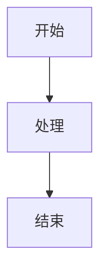

# Docsify 自定义指南

## 修改主题色

编辑 `docs/index.html`，修改 CSS 变量：

```css
:root {
  --theme-color: #42b883; /* 改为目标主题色 */
}
```

## 修改项目图标

编辑 `docs/index.html` 中 favicon 的 emoji：

```html
<link
  rel="icon"
  href="data:image/svg+xml,<svg xmlns=%22http://www.w3.org/2000/svg%22 viewBox=%220 0 100 100%22><text y=%22.9em%22 font-size=%2290%22>🚀</text></svg>"
/>
```

## 添加代码语言高亮

在 `docs/index.html` 的 `<!-- 代码高亮 -->` 部分添加：

```html
<script src="//cdn.jsdelivr.net/npm/prismjs@1/components/prism-[语言].min.js"></script>
```

已内置语言：javascript, typescript, jsx, tsx, css, scss, html, java, python, bash, yaml, json, markdown, docker, sql

## Markdown 编写规范

### 标题层级

- `# 一级标题`：每个页面只用一次，作为页面标题
- `## 二级标题`：主要章节
- `### 三级标题`：子章节
- `#### 四级标题`：详细说明

### Mermaid 图表

````markdown

````

### 代码块

添加语言标识以启用语法高亮：

````markdown
```javascript
const hello = "world";
```
````
