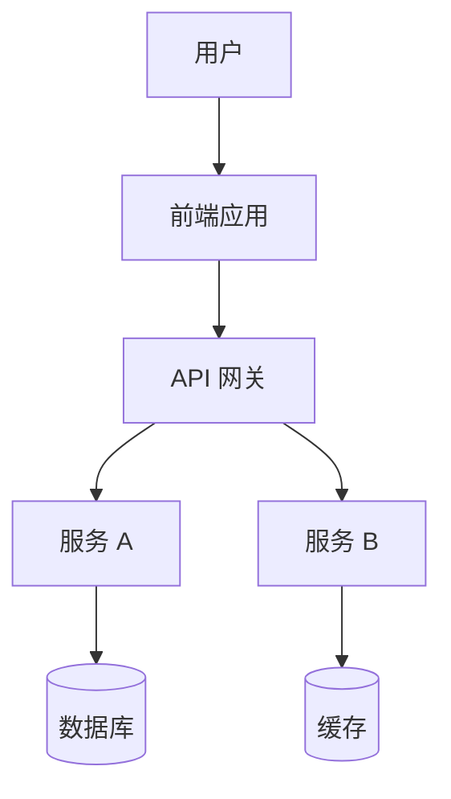
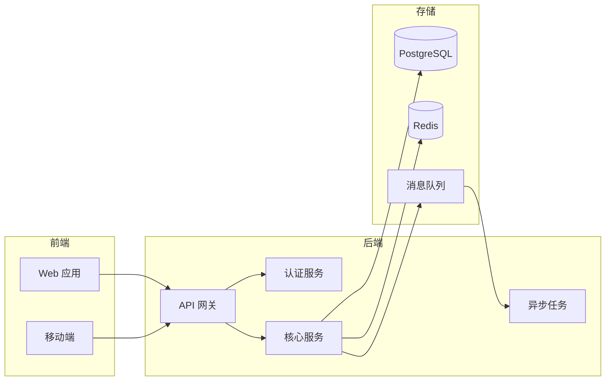
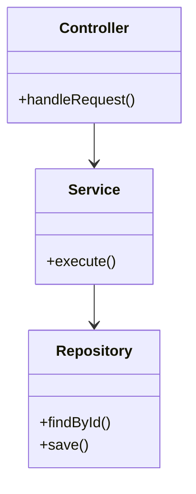
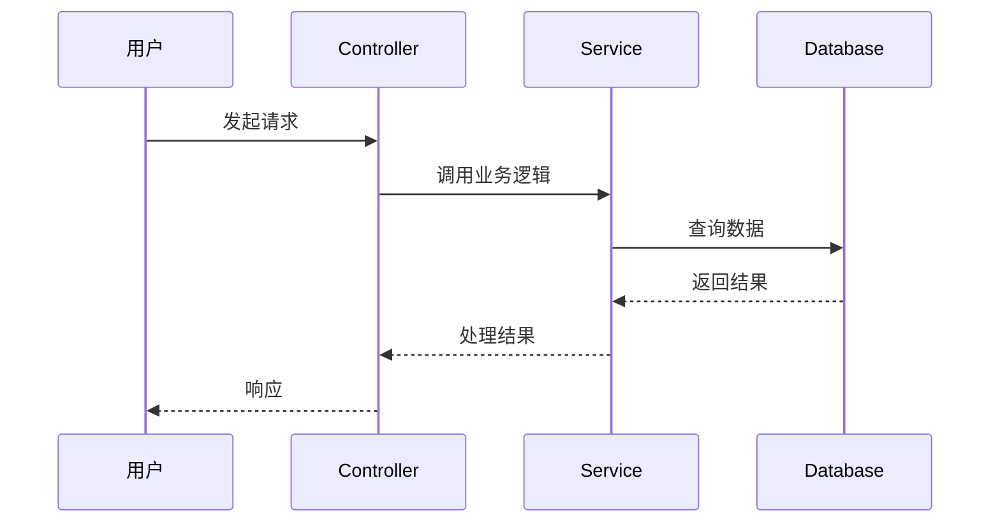
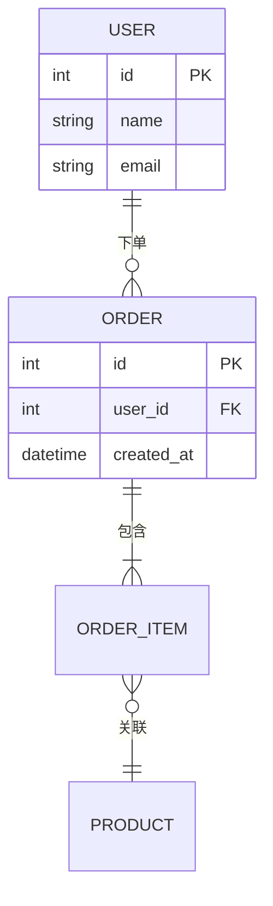

# 文档类型模板

每种文档类型的内容要求和 Mermaid 图表指南。根据项目实际情况选用，不必全部使用。

## 目录

- [项目概览](#项目概览)
- [系统架构](#系统架构)
- [代码结构](#代码结构)
- [数据流与核心逻辑](#数据流与核心逻辑)
- [API 与接口](#api-与接口)
- [数据模型与持久化](#数据模型与持久化)
- [配置与部署](#配置与部署)
- [开发指南](#开发指南)
- [前端架构](#前端架构)
- [安全与认证](#安全与认证)
- [测试策略](#测试策略)
- [性能与优化](#性能与优化)

---

## 项目概览

首篇文档，读者入口。

**必含内容**：
- 项目解决什么问题（一段话）
- 核心功能列表
- 技术栈摘要（语言、框架、数据库、基础设施）
- 高层架构 Mermaid 图

**Mermaid 示例**：


---

## 系统架构

**必含内容**：
- 模块划分及职责
- 模块间依赖关系图
- 服务通信方式（HTTP/gRPC/消息队列）
- 部署拓扑图（如适用）

**Mermaid 示例**：


---

## 代码结构

**必含内容**：
- 完整目录树（关键文件标注说明）
- 各目录/包的职责说明
- 核心类/模块的关系图

**Mermaid 示例**（类图）：


---

## 数据流与核心逻辑

**必含内容**：
- 核心业务流程的时序图
- 状态机（如有状态流转）
- 关键算法/逻辑的流程图

**Mermaid 示例**（时序图）：


---

## API 与接口

**必含内容**：
- 接口分类列表（按模块/资源）
- 每个接口：方法、路径、参数、返回值
- 认证方式
- 典型调用流程时序图

**格式示例**：
```markdown
### POST /api/users

创建新用户。

**请求体**：
| 字段 | 类型 | 必填 | 说明 |
|------|------|------|------|
| name | string | 是 | 用户名 |
| email | string | 是 | 邮箱 |

**响应**：
| 字段 | 类型 | 说明 |
|------|------|------|
| id | number | 用户 ID |
| name | string | 用户名 |
```

---

## 数据模型与持久化

**必含内容**：
- ER 图
- 表/集合的字段说明
- 关键索引和约束
- 数据迁移策略（如适用）

**Mermaid 示例**：


---

## 配置与部署

**必含内容**：
- 配置文件说明（每个配置项的含义）
- 环境变量列表
- Docker/容器化配置
- CI/CD 流程图

**Mermaid 示例**：


---

## 开发指南

**必含内容**：
- 本地开发环境搭建步骤
- 编码规范和目录约定
- 添加新功能的步骤示例
- 提交规范

---

## 前端架构

仅前端或全栈项目使用。

**必含内容**：
- 组件层级结构
- 状态管理方案
- 路由结构
- 样式方案

---

## 安全与认证

仅涉及安全机制的项目使用。

**必含内容**：
- 认证流程图
- 授权模型（RBAC/ABAC）
- 安全配置要点

---

## 测试策略

仅有测试体系的项目使用。

**必含内容**：
- 测试分层（单元/集成/E2E）
- 测试覆盖重点
- 运行测试的命令

---

## 性能与优化

仅涉及性能设计的项目使用。

**必含内容**：
- 缓存策略
- 数据库查询优化
- 并发/异步处理方案
