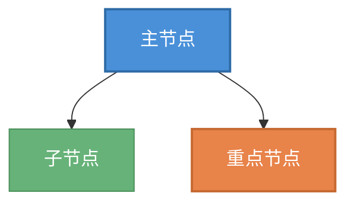
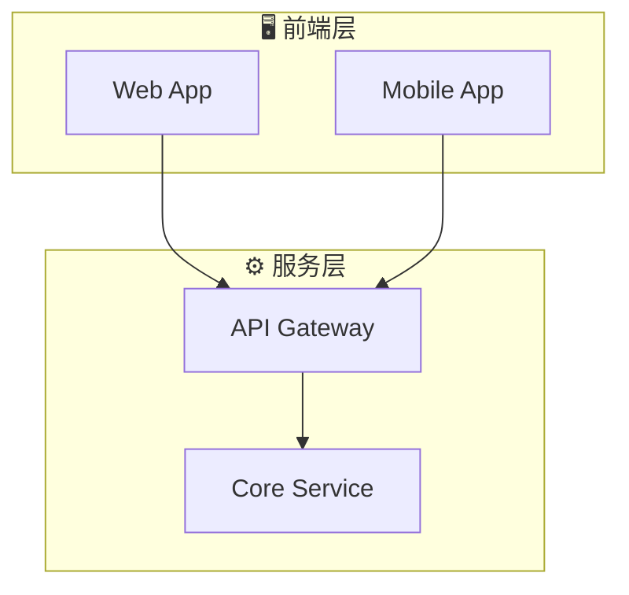
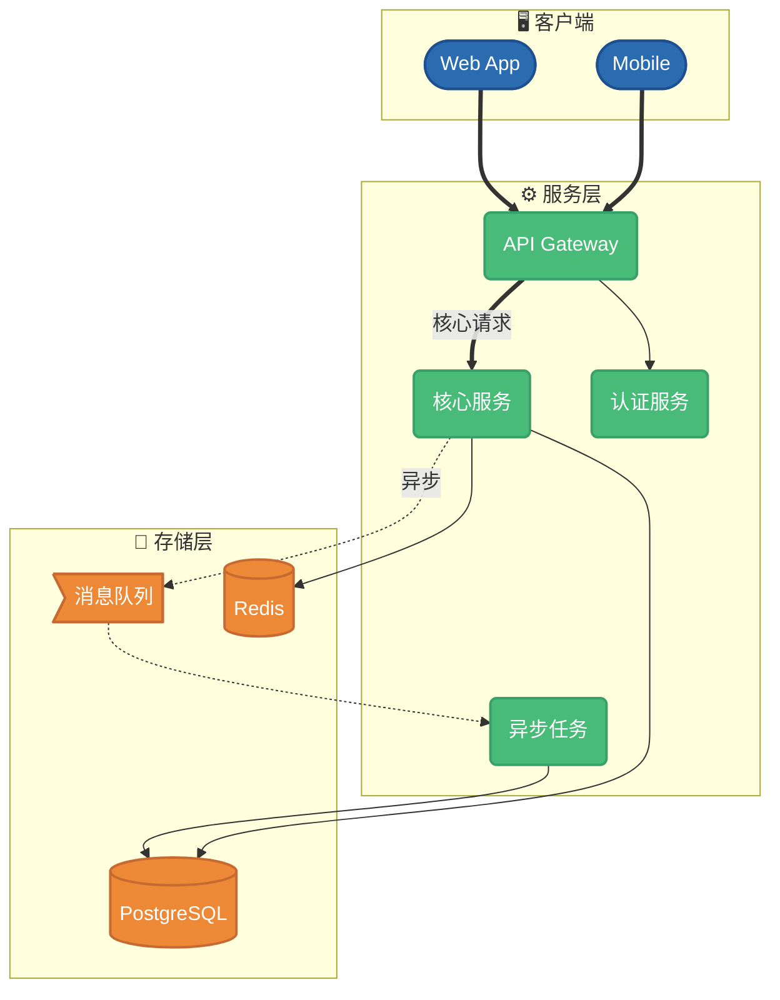
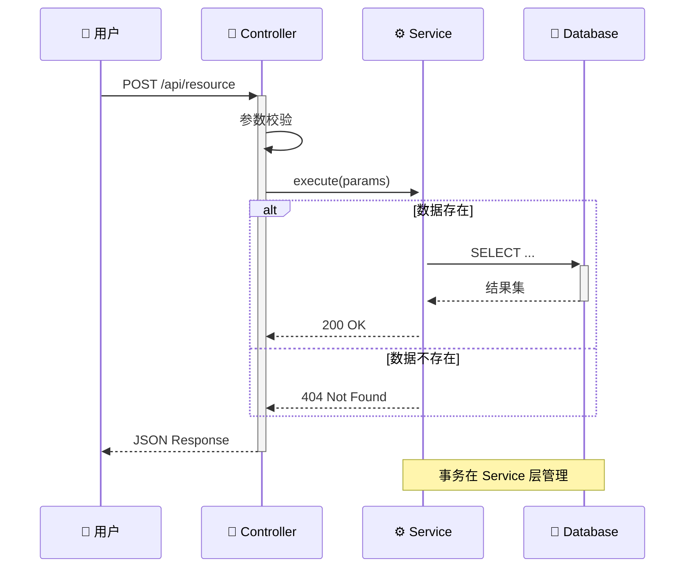
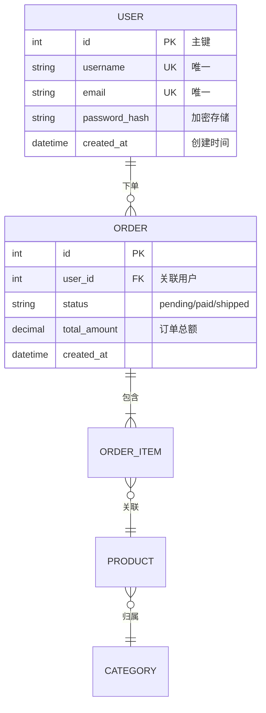
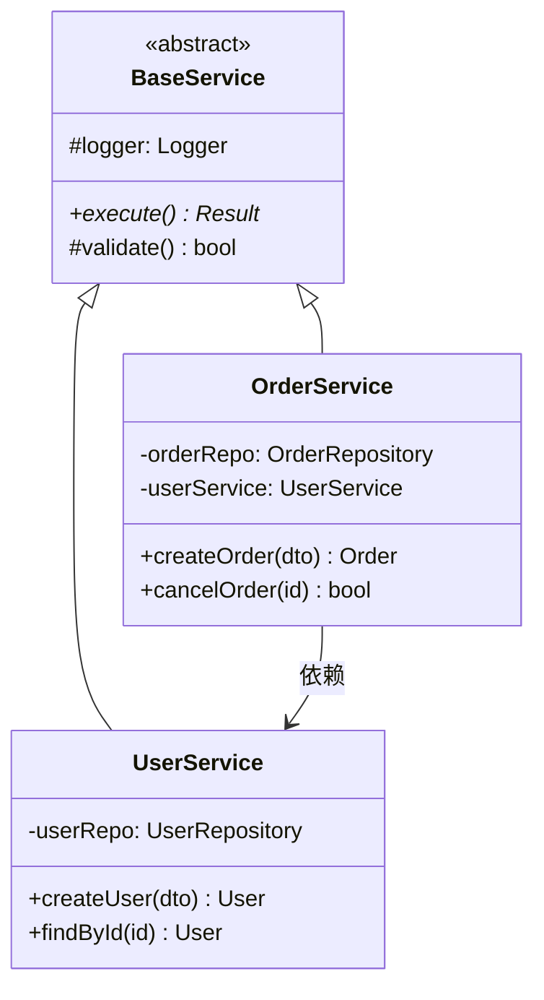

# Mermaid 美化指南（渲染安全）

本指南仅使用 Mermaid v10 稳定支持的语法，确保在 Docsify / GitHub / GitLab 中均可正常渲染。

## 目录

- [安全的样式方法](#安全的样式方法)
- [禁止使用的特性](#禁止使用的特性)
- [颜色方案](#颜色方案)
- [Flowchart 美化](#flowchart-美化)
- [Sequence Diagram 美化](#sequence-diagram-美化)
- [ER Diagram 美化](#er-diagram-美化)
- [Class Diagram 美化](#class-diagram-美化)

---

## 安全的样式方法

### classDef + ::: 内联应用（推荐）



### style 单独设置（备选）

仅支持以下属性：`fill`, `stroke`, `stroke-width`, `color`, `stroke-dasharray`

```
style nodeId fill:#f9f,stroke:#333,stroke-width:2px,color:#000
```

### subgraph 分组



---

## 禁止使用的特性

以下特性会导致渲染失败，**绝对不要使用**：

| 特性 | 问题 | 替代方案 |
|------|------|----------|
| `radius` | 不是合法属性 | 使用 `()` 圆角节点语法 |
| `font-size` | 多数渲染器忽略 | 无替代，保持默认 |
| `box-shadow` | 不支持 | 用 `stroke-width:2px` 增加层次感 |
| CSS gradient | 不支持 | 用纯色，通过色系层级区分 |
| `note` in flowchart | 语法错误 | 用虚线节点 `N["📌 说明"]:::note` |
| `click` 事件 | 安全限制常被禁用 | 不使用 |
| `%%{init:}%%` 主题覆盖 | 与宿主冲突 | 不使用，用 classDef |
| `linkStyle` + 复杂 CSS | 部分渲染器不支持 | 仅用 `linkStyle N stroke:#color` |

---

## 颜色方案

### 蓝色科技系（推荐通用）

```
classDef L1 fill:#1A365D,stroke:#0F2440,stroke-width:2px,color:#fff
classDef L2 fill:#2B6CB0,stroke:#1E5090,stroke-width:2px,color:#fff
classDef L3 fill:#4A90D9,stroke:#3474B8,stroke-width:1px,color:#fff
classDef L4 fill:#90CDF4,stroke:#63B3ED,stroke-width:1px,color:#1A365D
```

### 绿色清新系

```
classDef L1 fill:#1C4532,stroke:#133726,stroke-width:2px,color:#fff
classDef L2 fill:#276749,stroke:#1E5038,stroke-width:2px,color:#fff
classDef L3 fill:#48BB78,stroke:#38A169,stroke-width:1px,color:#fff
classDef L4 fill:#9AE6B4,stroke:#68D391,stroke-width:1px,color:#1C4532
```

### 多色区分系（适合多模块架构图）

```
classDef frontend fill:#4A90D9,stroke:#2E6BA6,stroke-width:2px,color:#fff
classDef backend fill:#48BB78,stroke:#38A169,stroke-width:2px,color:#fff
classDef storage fill:#ED8936,stroke:#C66A32,stroke-width:2px,color:#fff
classDef infra fill:#9F7AEA,stroke:#7C5CC4,stroke-width:2px,color:#fff
classDef external fill:#A0AEC0,stroke:#718096,stroke-width:1px,color:#fff
```

---

## Flowchart 美化

### 节点形状选择

| 语法 | 形状 | 适用 |
|------|------|------|
| `A[文本]` | 方形 | 一般模块 |
| `A(文本)` | 圆角 | 服务/流程 |
| `A([文本])` | 体育场形 | 起止点 |
| `A[(文本)]` | 圆柱 | 数据库/存储 |
| `A{文本}` | 菱形 | 判断/条件 |
| `A{{文本}}` | 六边形 | 准备/处理 |
| `A>文本]` | 旗帜形 | 异步/事件 |

### 连线类型

| 语法 | 效果 | 适用 |
|------|------|------|
| `-->` | 实线箭头 | 普通调用 |
| `==>` | 粗实线箭头 | 核心路径/重要调用 |
| `-.->` | 虚线箭头 | 可选/异步 |
| `-->｜标签｜` | 带标签实线 | 说明关系 |
| `==>｜标签｜` | 带标签粗线 | 强调核心流程 |

### 完整示例



---

## Sequence Diagram 美化

Sequence diagram 不支持 classDef。使用以下方式美化：

- **participant 别名**：提供简洁显示名
- **activate/deactivate**：显示生命周期
- **alt/opt/loop**：条件/可选/循环块
- **Note**：在 sequence diagram 中 Note 是合法的



---

## ER Diagram 美化

ER diagram 样式有限，通过以下方式提升可读性：

- 使用中文关系标签
- 字段标注 PK/FK/UK
- 类型明确标注



---

## Class Diagram 美化



---

## 快速检查清单

生成 Mermaid 后，逐项检查：

- [ ] 无 `radius`、`font-size`、`box-shadow`、`gradient` 属性
- [ ] 无 `%%{init:}%%` 指令
- [ ] flowchart 中无 `note`（仅 sequence diagram 可用）
- [ ] `classDef` 仅用 `fill/stroke/stroke-width/color/stroke-dasharray`
- [ ] `subgraph` 标题用双引号包裹中文
- [ ] 节点 ID 不含特殊字符（空格、括号），显示文本放在 `[]/()/{}` 内
- [ ] 箭头语法正确（`-->` 不是 `-->`）
- [ ] 每个图表在独立的 ` ```mermaid ` 代码块中
